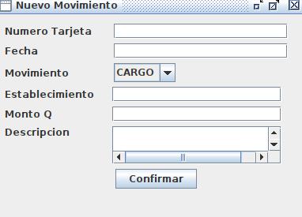

# Gestor de Tarjetas de Credito

## 1. Introducción

Este es un programa que permite manipular registros de tarjetas de credito mediante un archivo de entrada que contiene las instrucciones, y tambien a traves de la interfaz de usuario.
Funcionalidades: solicitar, autorizar y consultar tarjetas, realizar cargos y abonos, ver estados de cuenta, etc.

## 2. Instalación

1. Clonar el repositorio.
2. Crear la base de datos en base al mapeo fisico.
3. Cambiar las credenciales en la clase Conexion.

## 3. Interfaz de Usuario

### 3.1. Pantalla Principal

Al iniciar el programa, se presentara una pantalla principal con varias opciones.

- **Barra de Menú**: Accede a todas las funcionalidades del programa directamente.

## 4. Gestiones

Antes de iniciar cualquier gestion se recomienda elegir el la carpeta destino donde se guardaran todos los reportes, de lo contrario se guardaran en la carpeta en donde esta el programa.

### 4.1. Archivo de entrada

Permite cargar un archivo de entrada con las instrucciones.
La sintaxis debe ser la siguiente:

SOLICITUD(NUMEROSOLICITUD, FECHA, TIPO, NOMBRE, SALARIO, DIRECCION);
MOVIMIENTO(NUMERO, FECHA, TIPOMOVIMIENTO, DESCRIPCION, ESTABLECIMIENTO, MONTO);
CONSULTAR_TARJETA(NUMERO);
AUTORIZACION_TARJETA(NUMEROSOLICITUD);
CANCELACION_TARJETA(NUMERO);
ESTADO_CUENTA();
LISTADO_TARJETAS();
LISTADO_SOLICITUDES();

Reglas:
Las instrucciones se deben apilar una sobre otra en un archivo de texto.
Las fechas deben tener un formato dd/MM/yyyy.
El tipo de tarjeta solo puede ser NACIONAL, REGIONAL O INTERNACIONAL.
Los salarios y montos pueden tener hasta dos decimales maximo.
El tipo de movimiento puede ser unicamente CARGO o ABONO.

### 4.2. Solicitudes

### 4.3. Movimientos

### 4.4. Consultas

### 4.5. Autorizaciones

### 4.6. Cancelaciones

### 4.7. Estado de cuenta

### 4.8. Listado de tarjetas

### 4.9. Listado solicitudes

